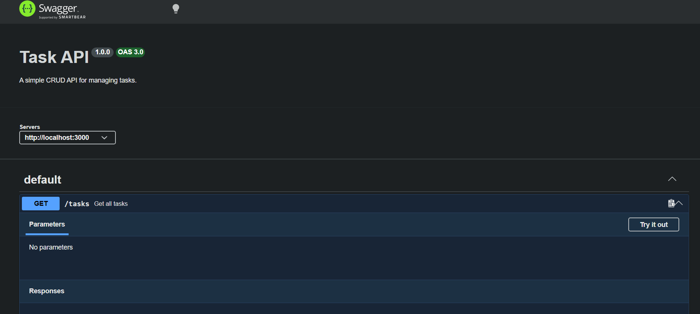

# Task API

A simple REST API built with Node.js and Express for managing tasks.

The API supports creating, reading, updating, and deleting tasks. It uses an in-memory array as its database.

## Installation

Clone the repository and install the required dependencies:

```bash
npm install
```

## Running the API

Start the server with:

```bash
npm start
```

The API will run at:

http://localhost:3000

## API Endpoints

| Method | Endpoint | Description |
|---|---|---|
| GET | `/` | Returns information about the API |
| GET | `/health` | Checks if the server is running |
| GET | `/tasks` | Returns all tasks |
| POST | `/tasks` | Creates a new task |
| GET | `/tasks/:id` | Returns one task |
| PUT | `/tasks/:id` | Updates a task |
| DELETE | `/tasks/:id` | Deletes a task |

## Example Request

The following example retrieves task number 1:

```text
PASTE YOUR ACTUAL curl -i OUTPUT HERE
```

## Swagger Documentation

The API is documented using Swagger UI.

Open Swagger UI in your browser:

http://localhost:3000/docs


HTTP/1.1 200 OK
X-Powered-By: Express
Content-Type: application/json; charset=utf-8
Content-Length: 36
ETag: W/"24-z9YvOlHIU8h/sqqab7daAnCZ8kQ"
Date: Wed, 26 Aug 2026 14:16:19 GMT
Connection: keep-alive
Keep-Alive: timeout=5

{"id":1,"title":"learn","done":true}

 